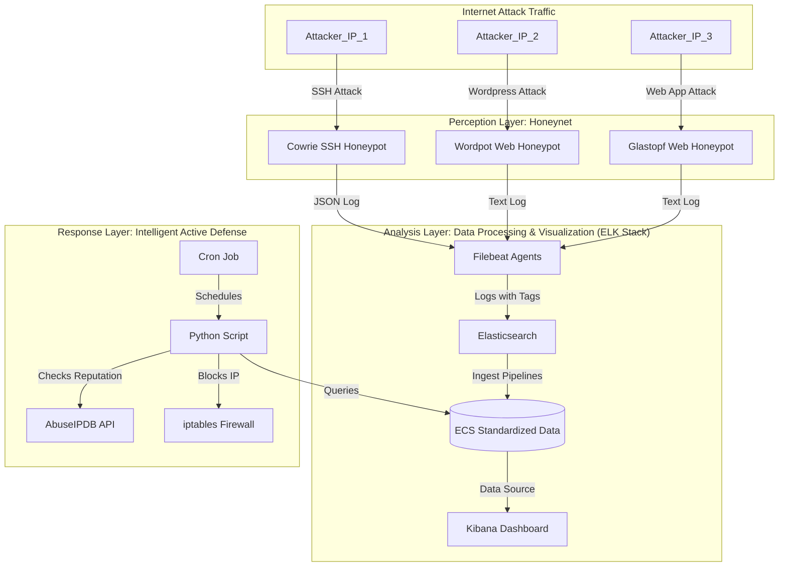

[**English**](#-english-version) | [**中文**](#-中文版)

---

<h1 id="-english-version">🇬🇧 English Version</h1>

# An Interactive Honeynet with an Intelligent Active Defense System


### 📖 Project Overview

This project is a fully functional, highly automated cybersecurity practical platform. It captures global cyberattacks in real-time by deploying a diverse honeynet, utilizes the ELK Stack for big data analysis and visualization, and integrates Python scripts for threat intelligence correlation and automated active defense, forming a complete security loop from **"Perception → Analysis → Decision → Response"**.

#### ✨ Design Philosophy

* **Modularity & Scalability**: All components are containerized using Docker, with clear responsibilities, making it easy to independently upgrade, replace, or extend with new honeypot nodes.
* **Data Standardization**: Adheres to the Elastic Common Schema (ECS) by using Ingest Pipelines to process heterogeneous log data into a standardized, analysis-ready format.
* **Intelligent Decision-Making**: Fuses external threat intelligence (from AbuseIPDB) with internal behavioral data (attack frequency) to make more precise defense decisions with a lower false-positive rate than single-rule systems.
* **Automated Closed-Loop Response**: The entire response process, from attack capture to IP blocking, requires no manual intervention, achieving 24/7 autonomous defense.

---

### 📊 Live Dashboard Showcase

*The core output of the platform is a powerful, interactive, and multi-dimensional global situational awareness dashboard, providing one-stop intelligence analysis and decision support.*

[](https://github.com/Bastandern/interactive-honeynet-platform/blob/main/assets/images/dashboard_overview.png)

---

### 🚀 Core Features

-   **Diverse Threat Perception**: Simultaneously deploys an SSH honeypot (`Cowrie`), a Wordpress honeypot (`Wordpot`), and a web application honeypot (`Glastopf`) to capture various types of attack traffic.
-   **Real-time Data Processing & Enrichment**: Uses `Filebeat` for unified log collection and `Elasticsearch Ingest Pipelines` for real-time parsing, ECS standardization, and GeoIP enrichment.
-   **Interactive Situational Awareness**: A professional-grade dashboard built with `Kibana Lens` that supports interactive drill-down analysis from a macro view (global map, attack trends) to a micro view (top IPs/countries/passwords/commands).
-   **Intelligent Active Defense**: A Python core script automatically aggregates and analyzes high-risk attackers, queries the `AbuseIPDB` threat intelligence database for reputation, and combines it with local attack frequency to intelligently decide and automatically block malicious IPs using `iptables`.
-   **24/7 Autonomous Operation**: The entire platform is built with `Docker Compose`, and the core defense script is scheduled for periodic execution via `cron`, with its output logged for auditing.

---

### 🛠️ Architecture & Data Flow

This project adopts a modern, containerized microservices architecture with a clear data flow and distinct component responsibilities.


**Data Flow Explanation**: Attack traffic is captured by various honeypots. Their respective Filebeat agents add tags to the logs and send them to Elasticsearch. Elasticsearch Ingest Pipelines parse, rename, and enrich the raw logs with GeoIP data, converting them into the ECS format. Kibana visualizes this standardized data. Concurrently, a backend Python script, triggered by Cron, queries the data from Elasticsearch, analyzes it in conjunction with the AbuseIPDB API, and finally calls iptables to block malicious IPs.

---

### 💻 Technology Stack

| Component | Technology | Core Role |
| :--- | :--- | :--- |
| **Container Orchestration** | Docker, Docker Compose | Provides environment isolation; enables one-click deployment and management. |
| **Honeypot Nodes** | Cowrie, Wordpot, Glastopf | Simulate vulnerable services to act as sensors for attack traffic. |
| **Log Collection** | Filebeat | A lightweight log shipper responsible for collecting and forwarding logs. |
| **Data Storage & Analysis** | Elasticsearch | The core data engine for storing, indexing, searching, and aggregating data. |
| **Data Visualization** | Kibana | A powerful visualization tool for building interactive dashboards. |
| **Automation Script** | Python 3 | The "brain" of the platform, performing analysis, intel correlation, and defense decisions. |
| **Scheduling** | Cron | A time-based job scheduler for periodically triggering the Python script. |
| **Firewall** | iptables | The Linux kernel firewall, serving as the endpoint for automated defense actions. |

---

### 🚀 Deployment & Operation Manual

#### 1. Prerequisites
* A Linux server with a public IP address (Ubuntu 20.04+ recommended).
* [Docker](https://get.docker.com/) and [Docker Compose](https://docs.docker.com/compose/install/) installed.
* The command `sysctl -w vm.max_map_count=262144` must be executed on the host to meet Elasticsearch's memory requirements.

#### 2. Configuration
1.  **Clone the repository**:
    ```bash
    git clone https://github.com/Bastandern/interactive-honeynet-platform.git
    cd interactive-honeynet-platform
    ```
2.  **Set Environment Variables**:
    * In the `scripts/` directory, fill in your AbuseIPDB API Key in the `ABUSEIPDB_API_KEY` variable within the `auto_blocker.py` file.

#### 3. Launch the Platform
1.  **Start all services**:
    ```bash
    docker compose up -d
    ```
2.  **Verify service status**:
    ```bash
    docker compose ps
    ```
    *Ensure the `State` of all containers is `Up` or `running`. Elasticsearch may take 1-2 minutes to start.*

#### 4. Initialization
1.  **Configure Kibana Index Pattern**:
    * On your first visit to Kibana at `http://YOUR_SERVER_IP:5601`.
    * Go to **Stack Management > Index Patterns**, create an index pattern named `filebeat-*`, and select `@timestamp` as the time field.
2.  **Deploy Elasticsearch Configurations**:
    * The `elk_configurations/` directory contains the JSON definitions for all pipelines and templates.
    * Run the content of these JSON files one by one in Kibana's **Dev Tools** to create the Ingest Pipelines and Index Template.

#### 5. Deploy Active Defense
1.  **Test the script manually**:
    ```bash
    # Navigate to the script directory
    cd scripts
    # Grant execution permissions
    chmod +x auto_blocker.py
    # Run once to check for errors
    python3 auto_blocker.py
    ```
2.  **Set up the Cron Job**:
    ```bash
    # Edit the current user's crontab
    crontab -e
    # Add the following line at the end (ensure you use the absolute path to the script)
    0 * * * * /usr/bin/python3 /path/to/your/project/scripts/auto_blocker.py >> /path/to/your/project/scripts/auto_blocker.log 2>&1
    ```

#### 6. Start Analyzing!
After waiting for some time to collect attack data, you can start building or using your dashboard in Kibana.

---

### 🎯 Future Work

-   [ ] **API Service**: Encapsulate the core functionalities of the Python script into a RESTful API (e.g., using Flask).
-   [ ] **Web UI Development**: Build a dedicated front-end interface for displaying dashboard data and managing blocking policies.
-   [ ] **Honeynet Expansion**: Introduce more types of honeypots, such as database honeypots (e.g., ElasticHoney) or RDP honeypots.
-   [ ] **Security Alerting**: Configure ElastAlert or Kibana Alerting to send notifications upon detecting specific high-risk behaviors.

---

<h1 id="-中文版">🇨🇳 中文版</h1>

# 交互式蜜罐网络与智能化主动防御平台


### 📖 项目概述

本项目是一个功能完整、高度自动化的网络安全实战平台。它通过部署多元化的蜜罐网络，实时捕获全球网络攻击，利用 ELK Stack 进行大数据分析与可视化，并结合 Python 脚本实现威胁情报关联与自动化主动防御，形成了一个从 **“感知-分析-决策-响应”** 的完整安全闭环。

#### ✨ 设计理念

* **模块化与可扩展性**: 所有组件均通过 Docker 容器化，职责分明，易于独立升级、替换或扩展新的蜜罐节点。
* **数据标准化**: 遵循弹性通用范式 (ECS)，通过 Ingest Pipeline 将异构的日志数据，统一处理成标准化的、可供分析的数据格式。
* **智能决策**: 融合外部威胁情报 (AbuseIPDB) 与内部攻击行为数据（攻击频率），实现比单一规则更精准、误报率更低的防御决策。
* **自动化闭环**: 从攻击捕获到IP封禁，整个响应流程无需人工干预，实现 7x24 小时无人值守的自主防御。

---

### 📊 核心仪表盘

*平台的核心产出是一个功能强大的、可交互的、多维度的全局安全态势感知仪表盘，提供一站式的情报分析与决策支持。*

[](https://github.com/Bastandern/interactive-honeynet-platform/blob/main/assets/images/dashboard_overview.png)

---

### 🚀 核心功能

-   **多元化攻击感知**: 同时部署了 SSH 蜜罐 (`Cowrie`)、Wordpress 蜜罐 (`Wordpot`) 和 Web 应用蜜罐 (`Glastopf`)，能够捕获多种类型的攻击流量。
-   **实时数据处理与富化**: 使用 `Filebeat` 统一收集日志，通过 `Elasticsearch Ingest Pipeline` 进行实时解析、格式标准化 (ECS) 和地理位置信息 (GeoIP) 富化。
-   **交互式态势感知**: 基于 `Kibana Lens` 构建了专业级的可视化仪表盘，支持从宏观（全球地图、攻击趋势）到微观（Top IP/国家/密码/命令）的交互式下钻分析。
-   **智能化主动防御**: `Python` 核心脚本自动聚合分析高危攻击者，联动 `AbuseIPDB` 威胁情报库进行信誉查询，并结合本地攻击频率，智能决策并调用 `iptables` 自动封禁恶意 IP。
-   **7x24 小时无人值守**: 整个平台基于 `Docker Compose` 构建，核心防御脚本已通过 `cron` 实现周期性自动化运行，并将执行结果记录在日志中。

---

### 🛠️ 技术架构与数据流

本项目采用现代化的容器化微服务架构，数据流清晰，各组件职责分明。


**数据流说明**: 攻击流量被不同蜜罐捕获后，由各自的 Filebeat Agent 贴上标签并发送至 Elasticsearch。Elasticsearch 的 Ingest Pipeline 对原始日志进行解析、重命名和 GeoIP 富化，将其转换为 ECS 标准格式。Kibana 基于这些标准化的数据进行可视化。同时，后端的 Python 脚本由 Cron 定时触发，查询 Elasticsearch 中的数据，结合 AbuseIPDB API 进行分析，最终调用 iptables 执行封禁。

---

### 💻 技术栈详情

| 组件 | 技术 | 核心角色 |
| :--- | :--- | :--- |
| **容器化编排** | Docker, Docker Compose | 提供环境隔离、实现一键部署与管理整个平台。 |
| **蜜罐节点** | Cowrie, Wordpot, Glastopf | 模拟易受攻击的服务，作为攻击流量的感知探针。 |
| **日志采集** | Filebeat | 轻量级的日志采集器，负责从蜜罐收集日志并发送至下游。 |
| **数据存储与分析** | Elasticsearch | 核心的数据引擎，负责日志的存储、索引、搜索和聚合分析。 |
| **数据可视化** | Kibana | 强大的可视化工具，用于构建交互式仪表盘。 |
| **自动化脚本** | Python 3 | 平台的大脑，执行数据分析、情报关联和防御决策。 |
| **定时任务** | Cron | Linux 内置的调度工具，负责周期性地触发 Python 脚本。 |
| **防火墙** | iptables | Linux 内核防火墙，作为自动化防御的执行端点。 |

---

### 🚀 部署与运行手册

#### 1. 前提条件
* 一台拥有公网 IP 的 Linux 服务器 (推荐 Ubuntu 20.04+)。
* 已安装 [Docker](https://get.docker.com/) 和 [Docker Compose](https://docs.docker.com/compose/install/)。
* 服务器 `sysctl -w vm.max_map_count=262144` 命令已执行，以满足 Elasticsearch 的内存需求。

#### 2. 配置
1.  **克隆仓库**:
    ```bash
    git clone https://github.com/Bastandern/interactive-honeynet-platform.git
    cd interactive-honeynet-platform
    ```
2.  **配置环境变量**:
    * 在 `scripts/` 目录下，将你的 AbuseIPDB API Key 填入 `auto_blocker.py` 文件的 `ABUSEIPDB_API_KEY` 变量中。

#### 3. 启动平台
1.  **一键启动所有服务**:
    ```bash
    docker compose up -d
    ```
2.  **验证服务状态**:
    ```bash
    docker compose ps
    ```
    *确保所有容器的 `State` 均为 `Up` 或 `running`。Elasticsearch 可能需要1-2分钟完成启动。*

#### 4. 初始化配置
1.  **配置 Kibana 索引模式**:
    * 首次访问 Kibana `http://你的服务器IP:5601`。
    * 进入 **Stack Management > Index Patterns**，创建一个名为 `filebeat-*` 的索引模式，并选择 `@timestamp` 作为时间字段。
2.  **部署 Elasticsearch 配置**:
    * 项目中的 `elk_configurations/` 目录存放了所有管道和模板的 JSON 定义。
    * 请将这些 JSON 文件的内容，逐一通过 Kibana 的 **Dev Tools** 运行，以创建 Ingest Pipeline 和 Index Template。

#### 5. 部署主动防御
1.  **手动测试脚本**:
    ```bash
    # 进入脚本所在目录
    cd scripts
    # 赋予执行权限
    chmod +x auto_blocker.py
    # 手动运行一次，检查输出是否正常
    python3 auto_blocker.py
    ```
2.  **设置定时任务**:
    ```bash
    # 编辑当前用户的 crontab
    crontab -e
    # 在文件末尾添加以下行（请确保使用脚本的绝对路径）
    0 * * * * /usr/bin/python3 /path/to/your/project/scripts/auto_blocker.py >> /path/to/your/project/scripts/auto_blocker.log 2>&1
    ```

#### 6. 开始分析！
等待一段时间收集攻击数据后，你就可以开始在 Kibana 中构建或使用你的仪表盘了。

---

### 🎯 未来计划

-   [ ] **API 服务化**: 将 Python 脚本的核心功能封装成 RESTful API (e.g., using Flask)。
-   [ ] **Web UI 开发**: 构建一个独立的前端管理界面，实现对仪表盘数据的展示和对封禁策略的管理。
-   [ ] **扩展蜜罐网络**: 引入更多类型的蜜罐，如数据库蜜罐 (ElasticHoney)、远程桌面蜜罐等。
-   [ ] **安全告警**: 配置 ElastAlert 或 Kibana Alerting，在检测到特定高危行为时主动发送通知。